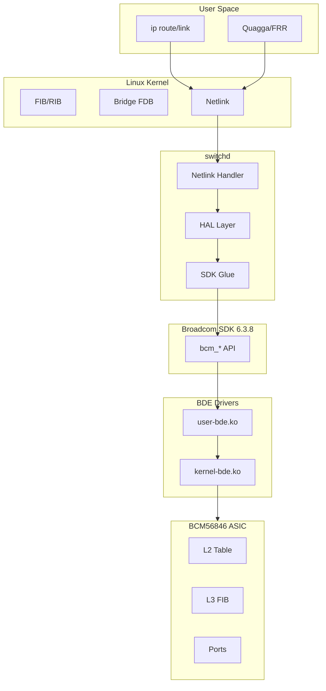
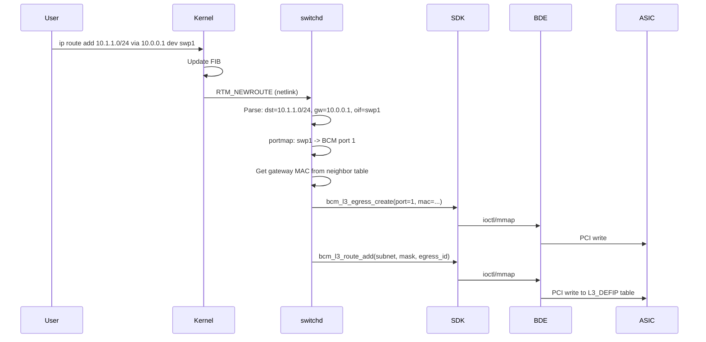
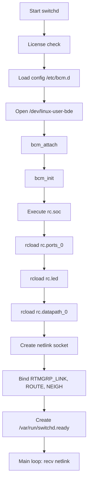
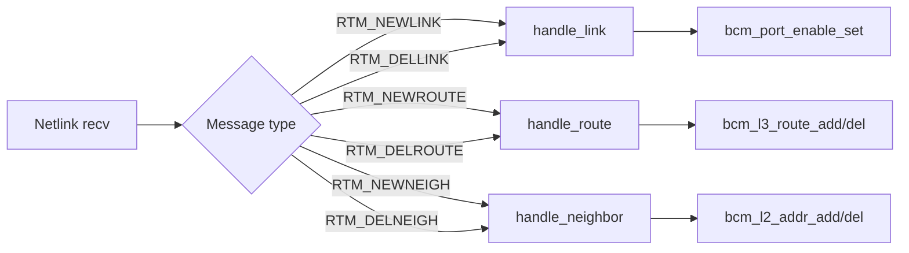
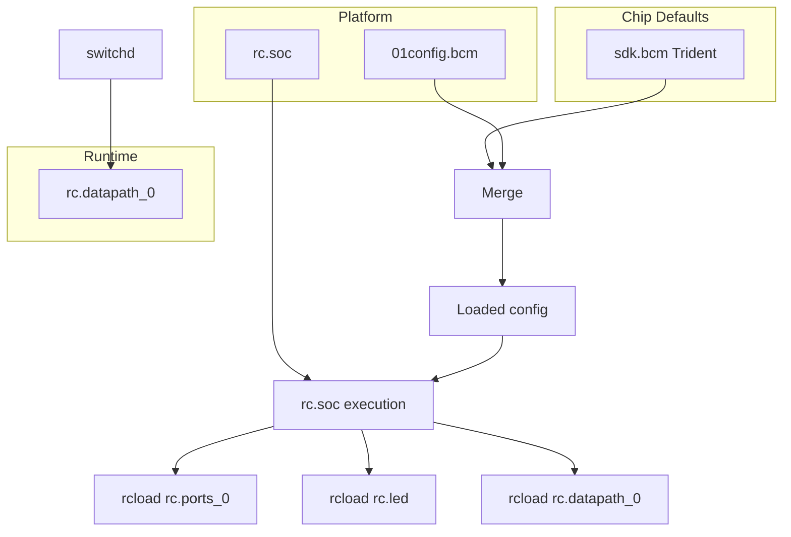

# Cumulus switchd Architecture Diagrams

**Date**: 2026-02-15

## 1. Component Interaction

## 2. Data Flow: Route Addition

## 3. Initialization Sequence

## 4. Netlink Handler Dispatch

## 5. Config File Flow

## References

- [initialization-sequence.md](initialization-sequence.md)
- [netlink-handlers.md](netlink-handlers.md)
- [BROADCOM_CUMULUS_ARCHITECTURE.md](../../BROADCOM_CUMULUS_ARCHITECTURE.md)
